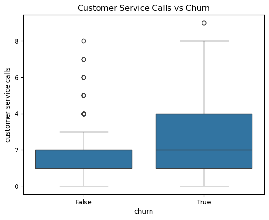

# SyriaTel--telecom-customer-churn-prediction
This project aims to develop a predictive model to identify customers likely to churn for SyriaTel, a telecommunication company.  By accurately predicting churn, SyriaTel can implement proactive retention strategies to mitigate its financial impact and improve customer satisfaction.   

# Customer Churn Prediction — SyriaTel Telecommunications

## Project Overview
Customer churn is a major challenge for telecommunications companies because losing customers reduces revenue and increases the cost of acquiring new ones.

This project builds a **machine learning classifier** to predict whether a customer will churn (stop doing business with SyriaTel). By identifying customers who are likely to leave, the company can take **proactive retention actions** such as targeted offers, improved customer support, or adjusted service plans.

## Business Problem
SyriaTel is experiencing customer churn, which leads to revenue loss and increased marketing costs. Currently, the company lacks a reliable way to identify customers who are likely to leave.

The goal of this project is to build a **binary classification model** that predicts whether a customer will churn. This allows the company to focus retention strategies on customers who are most at risk.

## Project Objectives
- Predict customer churn using machine learning models
- Identify key factors influencing churn
- Compare multiple classification algorithms
- Select the best-performing model
- Provide business recommendations to reduce churn

## Dataset
The dataset was obtained from **Kaggle** and contains:

- **3,333 customer records**
- **21 features**
- A mix of **numeric and categorical variables**

Feature categories include:

- Customer account details
- Service plan information
- Call usage patterns
- Customer service interactions
- Churn status (target variable)

## Exploratory Data Analysis

### Churn Distribution

- 85.5% of customers did **not churn**
- 14.5% of customers **churned**

This imbalance means metrics like **recall, precision, and ROC-AUC** are important for evaluating model performance.

---

### Customer Service Calls vs Churn

Customers who made **more customer service calls were more likely to churn**, suggesting dissatisfaction or unresolved service issues.

## Feature Engineering
New features were created to better capture customer behavior:

- **total_minutes** – total call minutes across all periods  
- **total_calls** – total number of calls  
- **service_call_rate** – ratio of service calls to total calls  
- **day_usage_ratio** – proportion of usage during daytime  

These features help summarize customer activity patterns that may indicate churn risk.

## Models Used
The following models were evaluated:

- Logistic Regression (baseline)
- Decision Tree
- Random Forest
- Tuned Random Forest (GridSearchCV)

## Model Performance

| Model | Accuracy | Precision | Recall | F1 Score | ROC-AUC |
|------|------|------|------|------|------|
| Logistic Regression | 0.865 | 0.569 | 0.299 | 0.392 | 0.820 |
| Decision Tree | 0.912 | 0.702 | 0.680 | 0.691 | 0.816 |
| Random Forest | 0.918 | 0.957 | 0.454 | 0.615 | 0.898 |
| **Tuned Random Forest** | **0.937** | **0.966** | **0.588** | **0.731** | **0.901** |

The **Tuned Random Forest** achieved the best overall performance.

---

## Feature Importance

Key predictors of churn include:

- Total day minutes
- Total usage minutes
- Service call rate
- Customer service calls
- International plan

These results suggest churn is influenced by **usage behavior and customer service interactions**.

## Business Recommendations
Based on the analysis, SyriaTel should consider the following strategies:

- Monitor customers with **frequent customer service calls**
- Provide tailored plans for **high daytime usage customers**
- Use the churn prediction model to **identify high-risk customers early**
- Implement **targeted retention campaigns**

## Technologies Used
- Python
- Pandas
- NumPy
- Scikit-learn
- Matplotlib
- Seaborn
- Jupyter Notebook

## Project Structure

Customer-Churn-Prediction/

data/  
    churn_dataset.csv  

notebooks/  
    churn_analysis.ipynb  

images/  
    visualizations  

README.md

